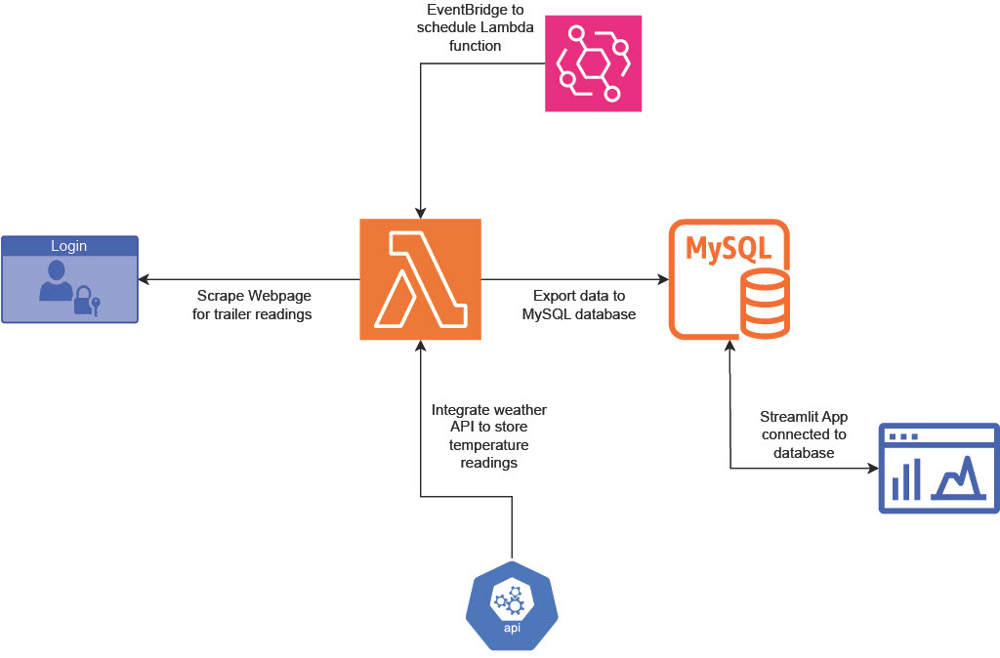

## Background
The main goal of this project was to track and analyze trailer fuel readings to be more informed of usage and better plan deliveries. The site around which this project was built, runs on Natural Gas and has three trailer trucks of fuel fed into the system at one time. The previous method for tracking these fuel tanks was monitoring a webpage portal that would post the pressure readings for each trailer in real-time. This page did not keep historical records of the tank readings so we had a limited understanding of burn rate and  difficulty tracking usage. The Natural Gas is used for providing heat to the building, so we prioritized gathering this data before entering the winter where we could potentially face a slew of logistical issues given the volume of fuel this site uses. 

## Architecture
First, I used AWS RDS to create and configure a MySQL cloud database. I was then able to utilize AWS Lambda to create a function that will scrape the webpage for Trailer 1, 2, and 3's pressure readings, use an API to pull the current temperature at the zipcode of the site, and export all the data into the MySQL database. Since the main reason for using a cloud function was automation, I scheduled the Lambda function to run using Amazon EventBridge. Finally, I created a Streamlit app that connects to the database so we can view the extracted data through visualizations and analyze it with statistical models. 

## AWS RDS - MySQL
Using AWS RDS I created a MySQL database to house the data for this project. I chose MySQL because of my familiarity with 'MySQL Workbench'. After creating and configurating the database, I connected to it using Workbench then used SQL commands to create the table where the data exported by our function will be stored. I created a value - 'ID' to serve as the Primary Key to go along with the date, time, a reading from Trailer 1, 2, and 3, the temperature at the site, and a boolean value 'Offline'. Initially I had the table setup with a value - 'label' that would be either Trailer 1, 2, or 3 but this caused a lot of redundancies in the data and was not as clean as I would have liked. 

## AWS Lambda Function
Originally, I planned to do this entire project in the Google Cloud Platform (GCP) because I was familiar with Google's 'Cloud Functions' and 'BigQuery' *at the time*. The main reason for not going with GCP was Cloud Functions. For this script, I was using Selenium and ChromeDriver which are rather large packages. It would have been more complicated than I would have liked if I went with Cloud Functions. Thankfully, AWS Lambda offers the ability to use 'Layers' which made it very easy to integrate Selenium and ChromeDriver into my script. I was able to compress and upload both Selenium and ChromeDriver as Layers and package the other binaries I needed in with my script which served as the Lambda function. Within the script, we are able to log in to the website portal, navigate through various pages on the site, extract the pressure readings for the three trailers, and **log out**. I found out pretty quickly that logging out of the site before closing and quitting the driver caused some issues with the site. There is a minimum number of active users on an account so this was a crucial step. The script also uses an API from 'OpenWeatherMap' to fetch the current temperature at the zip code of our site and I included a boolean value of 'Offline' to be stored in the data set. Every now and then the monitor on the trailers would be Offline and would not push any readings to the webpage. I thought to include this because we can track the reliability of the technology. Once the function was tested and working, it was scheduled to run every 20 minutes with Amazon EventBridge.

## Streamlit App
Once I had all the data collected, I had to extract insights from it. I chose Streamlit mainly for its accessibility and versatility. I was not sure how many people would be using this solution and a majority of people involved with this site are not typically tied to an office, so having access to the app on a mobile device was a big plus. I created two tabs; 'Dashboard' and 'Analysis'. The 'Dashboard' tab includes visualizations to see the latest pressure readings of each trailer, charts for a easy summary of usage, and some quick stats for each trailer. The quick stats include: last time full, average burn rate (hrs), estimated remaining fuel (hrs), and status (online/offline). On the 'Analysis' tab, I created a scatter plot to show the relationship between burn rate and temperature. This relationship is important because the fuel supplies heat to the facility and we want to efficiently deliver fuel when the customer needs it. Given that this system has three truck trailers parked there at all times, we are required to deliver fuel efficiently due to lack of space in the area. The 'Analysis' tab also has charts to track burn rate over time, temperature over time, and some summary statistics including: longest time spent offline, min and max burn rate, and longest time gone without re-fill. 

