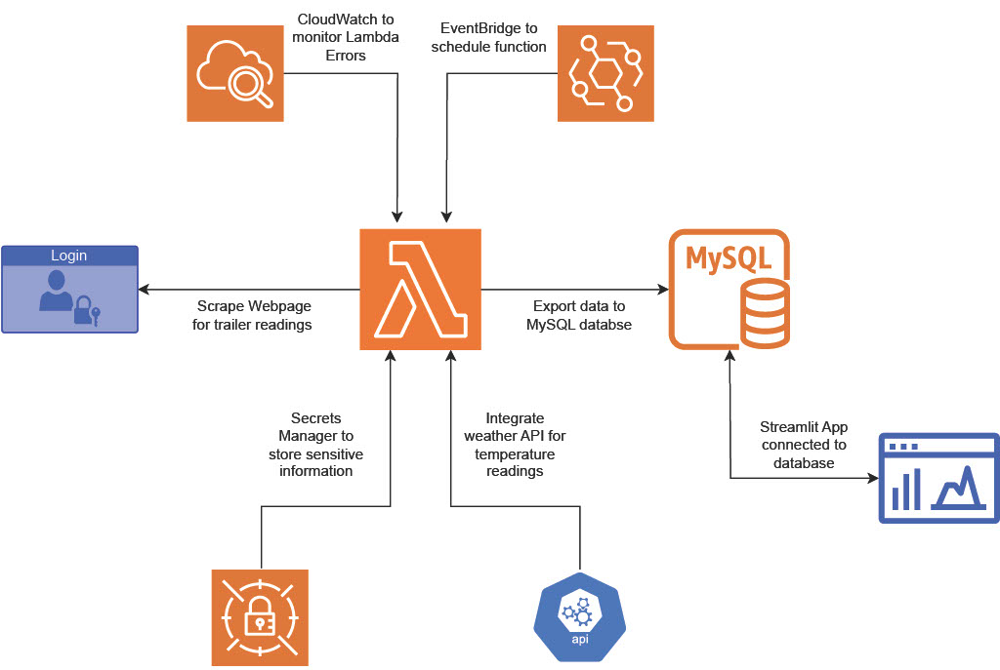

## Summary
The main goal of this project was to track and analyze trailer fuel readings to be more informed of usage and better plan deliveries. The site around which this project was built, runs on Natural Gas and has three trailer trucks of fuel fed into the system at one time. The previous method for tracking these fuel tanks was monitoring a webpage portal that would post the pressure readings for each trailer in real-time. This page did not keep historical records of the tank readings so we had a limited understanding of burn rate and  difficulty tracking usage. The Natural Gas is used for providing heat to the building, so we prioritized gathering this data before entering the winter where we could potentially face a slew of logistical issues given the volume of fuel this site uses. 

## Architecture
First, I used AWS RDS to create and configure a MySQL cloud database. I was then able to utilize AWS Lambda to create a function that will scrape the webpage for Trailer 1, 2, and 3's pressure readings, use an API to pull the current temperature at the zipcode of the site, and export all the data into the MySQL database. Since the main reason for using a cloud function was for automation, I scheduled the Lambda function to run using Eventbridge. Finally, I created a Streamlit app that connects to the database so we can view the extracted data through visualizations and analyze it with statistical models. 

